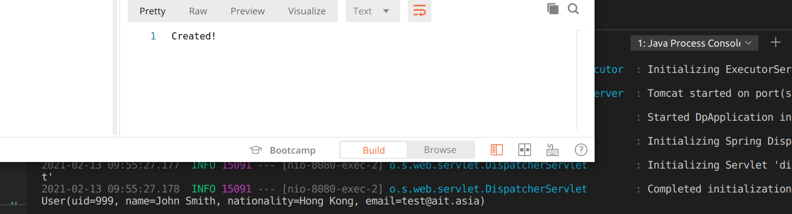
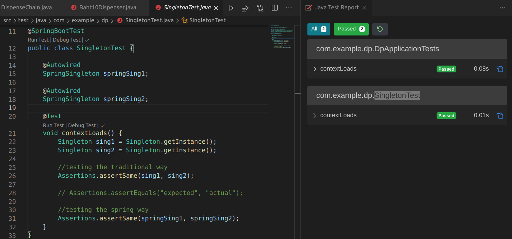
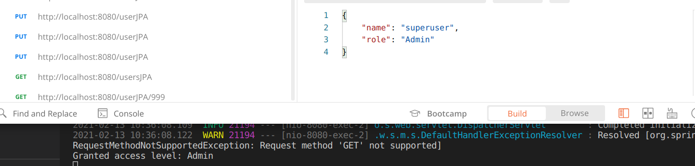
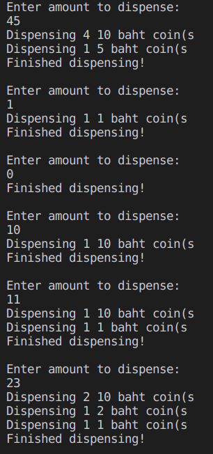
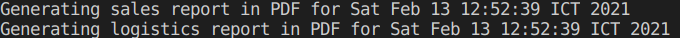

# HW3 Design Patterns and Spring Boot

Each design pattern is in its own respective package in the `src/main/java` folder.

Implemented design patterns(DPs):

1. Builder
2. Singleton
3. Factory
4. Chain of responsibility
5. State
6. Facade

**Note**: We have decided that these DPs have the highest chance to be used but they may change.

## Results

### Builder

### Singleton

### Factory

### CoR

### State

### Facade

