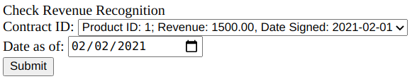
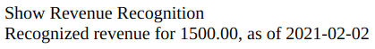
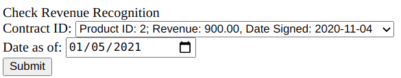
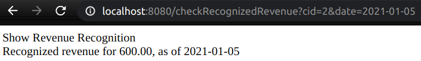
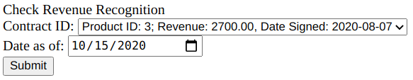
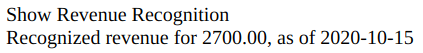

# Homework 4 - Revenue Recognition using Transaction Script

This repo contains a Revenue-Recognition (RR) project utlizing the **Transcript Script** architecture pattern as a domain logic pattern. This pattern bundles all the business logic of an entity inside one script. It interfaces with the DB using a `DataGateway` object instead of an ORM. Domain Logic basically means the business logic that the application is supposed to carry out.

## Business logic for RR

The following table is the business logic that the project tries to implement.

| Product | Strategy |
| ----------- | ----------- |
| Word Processor | Revenue recognized right away |
| Spreadsheet | 1/3 today, 1/3 in 60 days, 1/3 in 90 days |
| Database | 1/3 today, 1/3 in 30 days, 1/3 in 60 days |

## Results

### Word processor

***

### Spreadsheet

***

### Database

***

***
