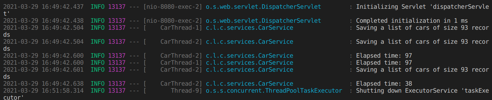
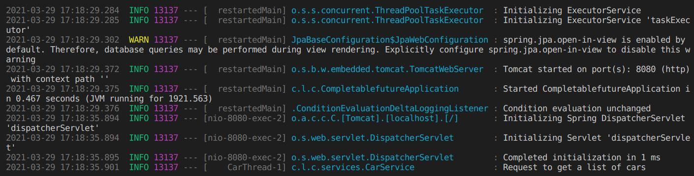
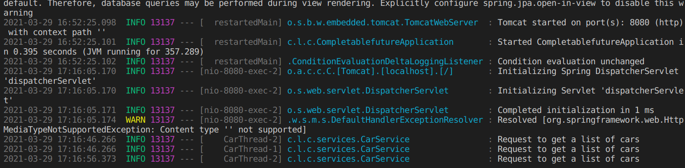

# Homework 5 : Multi-Thread and CompletableFuture

This homework demonstrates how to use Java's `CompleteableFuture` feature to implement multithreaded asynchronous applications.

## Async Configuration

We can set up a configuration file for the asynchronous threading that the application will use using the two annotations `@Configuration` and `@EnableAsync`. Multiple settings can be done here using the different executor methods such as `setCorePoolSize`.

## Important stuff

1. `@Async`. Annotation to denote method as asyncrhonous.
2. `CompleteableFuture.completedFuture`. Do callback once it's done and return `CompletableFuture` class with already completed given value.

## Async in Action - three POST requests

This experiment consists of three POST requests coming concurrently to the application but the **max thread size is set to only 2**. Therefore, the first two requests are handled concurrently but the third one is queued and handled only after the first two are handled. In the below iamge, it can be seen that the third one has a different timestamp.

## Async in Action - one GET request

## Async in Action - three GET requests

As seen above, the first 2 tasks are done simultaneously but the 3rd one has to wait because the **maximum number of threads is set to 2**.

***
