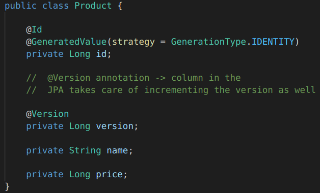
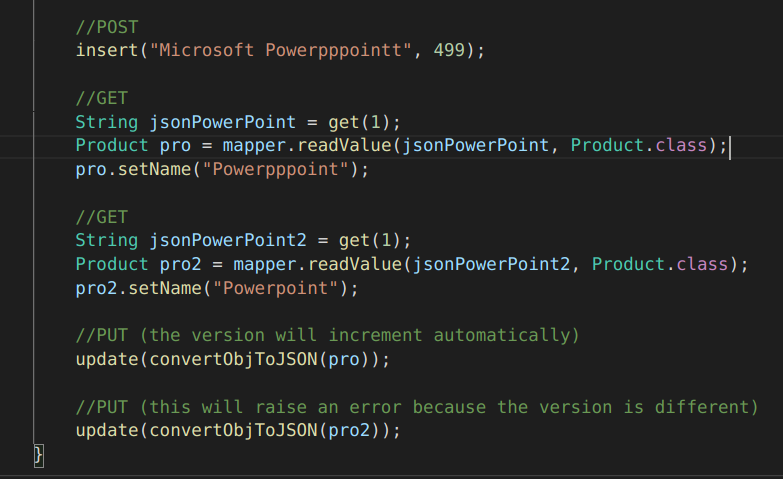
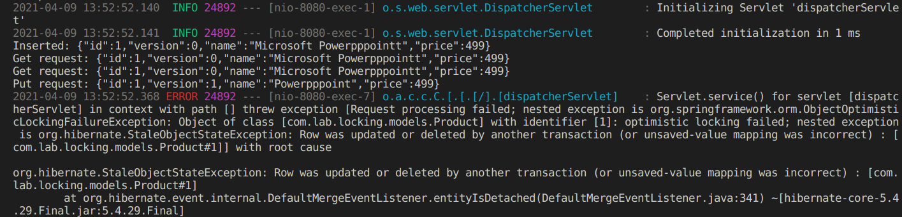
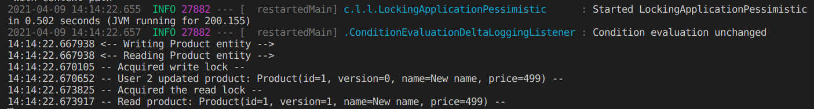
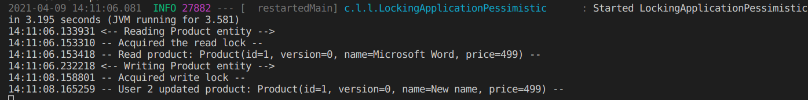
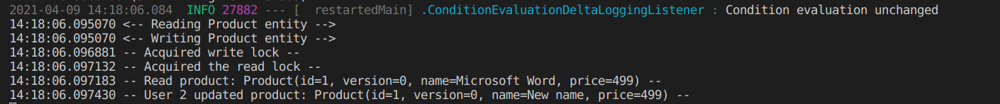
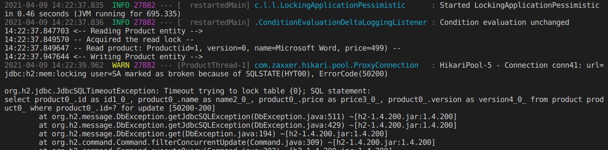

# HW6 Optimistic and Pessimistic Locking

## Optimistic Locking

Optimistic locking involves using a version number stored in the database to keep track of resources. This version number is managed by JPA and should not be manually managed. it can be used by using the `@Version` annotation as shown below.

Conflicts will be detected through the version number. In the example below, the 2nd update (the `update(convertObjToJSON(pro2))` method call) will fail because the first update has changed the `Product` and its version number. The `pro` and `pro2` refer to the same resource even though they are different instances. In this case, we simply output the exception but other handling can be done here also.

***

## Pessimistic Locking

Pessimistic locking completely locks out resources and blocks out any other transaction request on the particular resource. There are two types:

1. Read Lock.
Read locks prevent other transcations from writing but allow reading.

2. Write lock.
Write locks prevent other transcations from both reading and writing.

In SpringBoot, we can use the `@Lock` annotation on queries in DAO/Repo to lock the whole query transaction. For e.g. if want to make a query have a write lock, we can put `@Lock(LockModeType.PESSIMISTIC_WRITE)` or `@Lock(LockModeType.PESSIMISTIC_READ)` vice versa.

For testing purposes, we use concurrent threading and asynchronous configuration (see last [lab](https://github.com/AdamHtooLwin/SADHomework/tree/main/HW5/completablefuture)). Basically we will be using two threads to test concurrent access.

### Write-first

The reader does not acquire the lock and read the resource until after the writer is done updating the resource. We can see that both threads start simultaneously.

### Read-first

The reader acquires the lock first and the writer has to wait until the reader is done reading. The reason for the non simulatenous start is because the write thread is forced to wait 100ms.

### No locking

This is the result when the `@Lock` is removed. Even though the writer acquires the lock first, the reader has already read, meaning the reader has done **an inconsistent read**.

### Timeout

The reader is forced to sleep for 10000ms. The writer then throws an exception since the max time a lock can take is set to be 1000ms in the `application.properties`. This can help with potential **deadlocks**.

**Note**: The timeout is not exactly 1000ms. It also includes time for certain method calls, etc.
