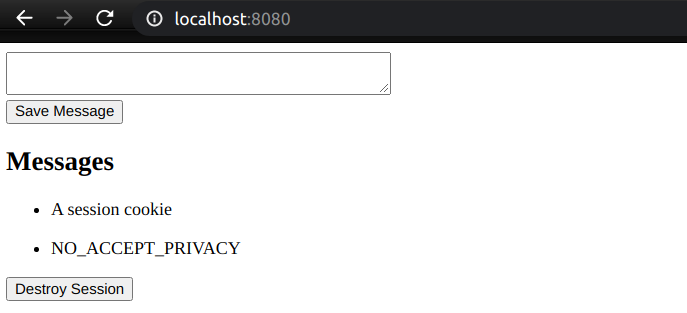
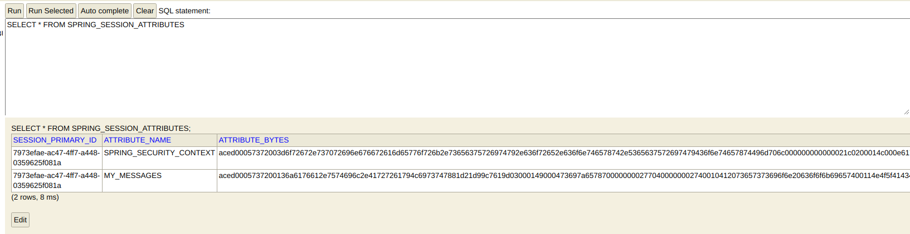
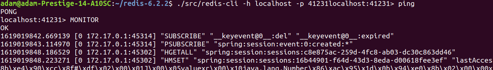
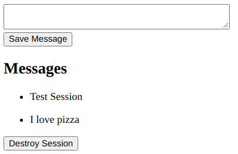
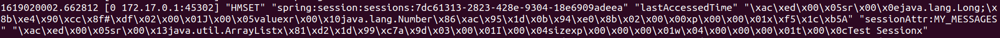
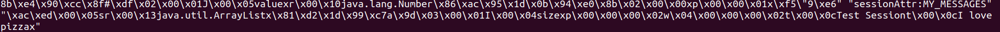

# Homework 7: Spring Session

This homework demonstrates the utilization of Spring's built-in session functionality to keep track of user sessions and attributes.

By default, Spring stores session information in the memory but we can config it to store in the database in the `application.properties` by adding this line.

`spring.session.store-type=jdbc`

## Testing

**Credentials**:

Username: `admin`

Password: `password`

Spring can store custom attributes in the session as well. In this case our attribute is called `MY_MESSAGES` and is an array of strings. We can add strings to the attribute in the form below.





As can be seen above, an attribute called `MY_MESSAGES` is created as a row in the `SPRING_SESSION_ATTRIBUTES` table. The actual array is not visible, only the bytes.

## Redis as a Session Store (Please see `session-redis` branch for implementation)

Redis can also be used as a session store in lieu of a relational database so as to provide more scalability and speed. It's very easy and only needs a few steps:

1. Replace the jdbc dep with these two dependencies in the `pom.xml`:

```xml
<dependency>
    <groupId>org.springframework.session</groupId>
    <artifactId>spring-session-data-redis</artifactId>
</dependency>

<dependency>
    <groupId>org.springframework.boot</groupId>
    <artifactId>spring-boot-starter-data-redis</artifactId>
</dependency>
```

2. Install Redis somewhere. In this case, it is installed as a docker container on the puffer server at port 41231. We can connect via:

`redis-cli -h localhost -p 41231`



First, we can verify connection. We can see the spring session stuff.



We still add messages through the same form as the relational implementation. We can then see the messages pop up on the redis monitor. Voila.





***
