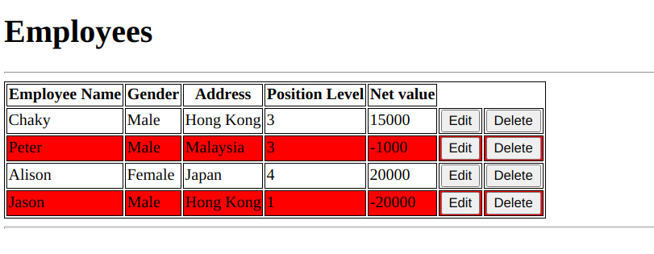

# Lab 1 Assignment - Employee Records

This application tracks employees and their performance via their net value. The net value is calculated by subtracting their salary from their value. It also allows for the editing and deletion of employees from the system.

This system uses JSTL and the associated dependencies are added through the Maven repo in pom.xml.

## Usage

The various features are outlined below and demonstrated via screenshots.

### Recordkeeping

All employees are listed on the homepage. Underperforming employees are marked in red.

## Deletion

Employee records can be deleted in one click via the delete button. Each button is associated with its respective row (employee).

## Editing

Once the edit button is clicked, you will be taken to the edit form.

Fill out the relevant details of the employee you want to change. Use the ID to select the specific employee.

**Note**: I have not figured out how to map each button to a specific employee so the form is general i.e. it works for all employees and must be **filled out completely**.
