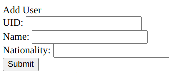
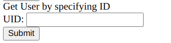
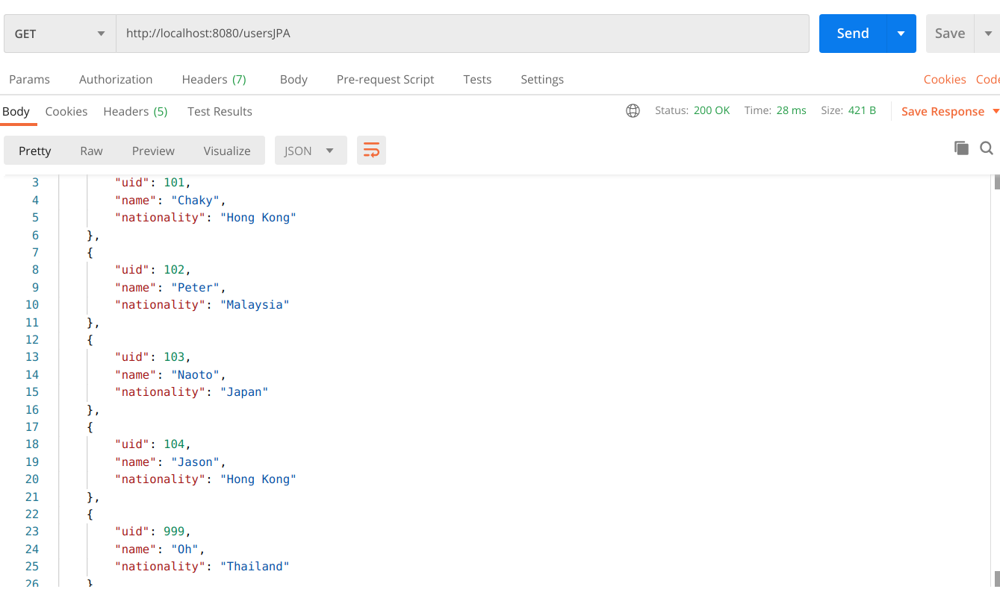
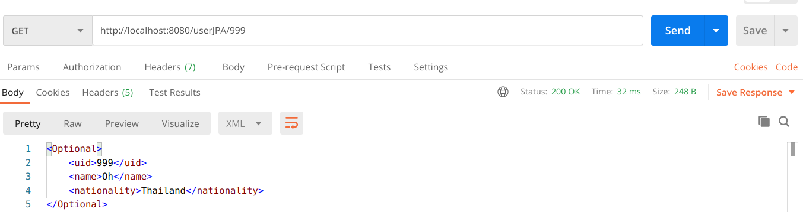
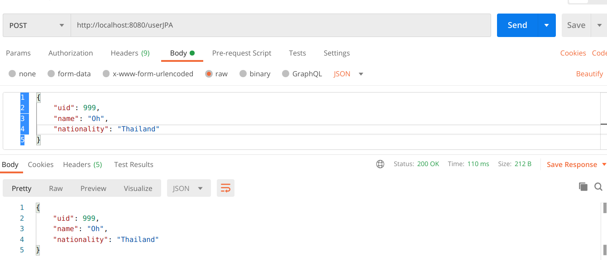
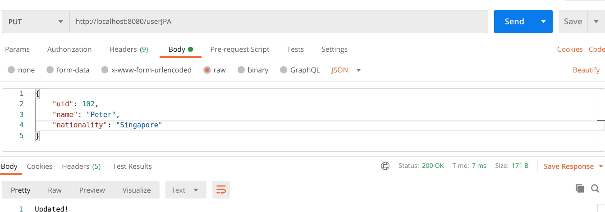
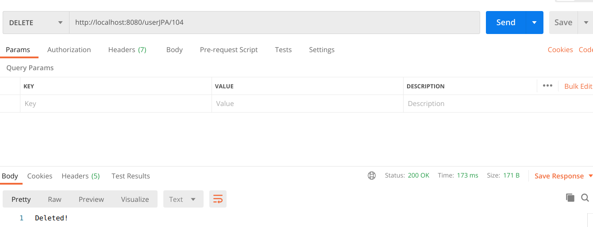

# Lab 1 - Sample RESTful User Management

This app contains a mixture of both RESTful and non-RESTful (jsp) endpoints. The various features are demonstrated via screenshots below.

## Add user (RequestBody)

## Get user form (HTTP param)

## RESTful interfaces

