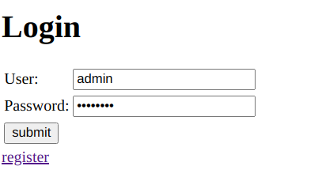

# Lab 2 - Spring Security

This lab illustrates a basic flow of the authentication and authorization mechanisms allowed by Spring Boot. This lab also explores basic form validation. What this lab can do:

1. Basic sign-in, sign-out, register functionalities.

2. Email notification through [mailtrap](https://mailtrap.io/).

The three main files related to Security are the `SecurityConfig.java`, `UserServiceImpl.java` and `UserService.java` but most of the authentication and access control is done in `SecurityConfig.java`. The email logic is done in `EmailSerciceImpl.java`.

## Sample user data

These users are already in the DB on startup.

1. **(Admin)** `username` - admin, `password` - password,
2. **(User)** `username` - john, `password` - password

## Results

### Login Page

***

### Form Validation

***

***

### Admin sign-in

***

### User sign-in

***

### Email (not sure if this is how it's supposed to work)

***

***
