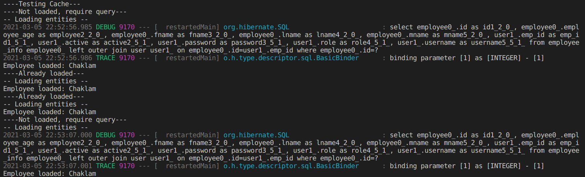
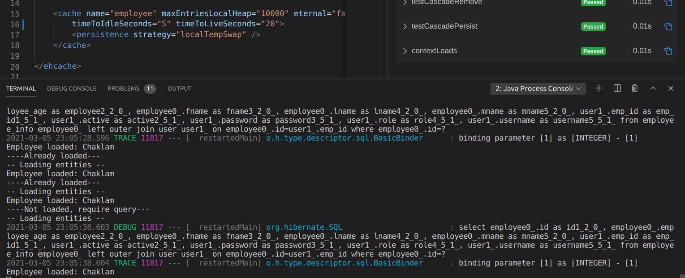
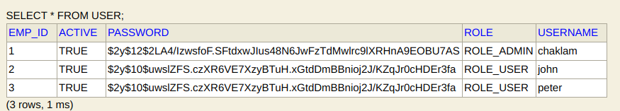
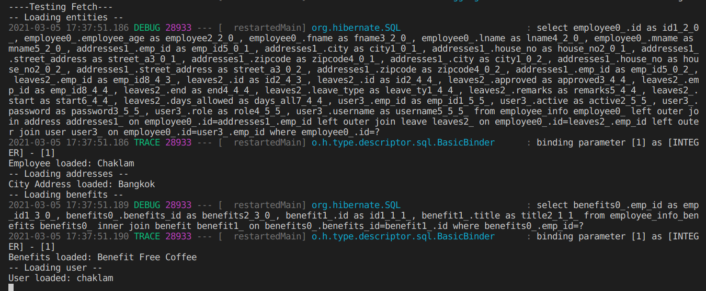
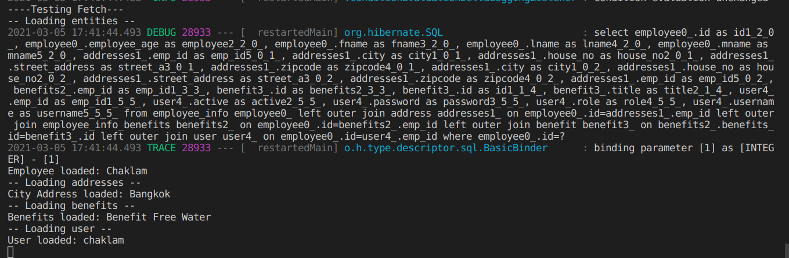
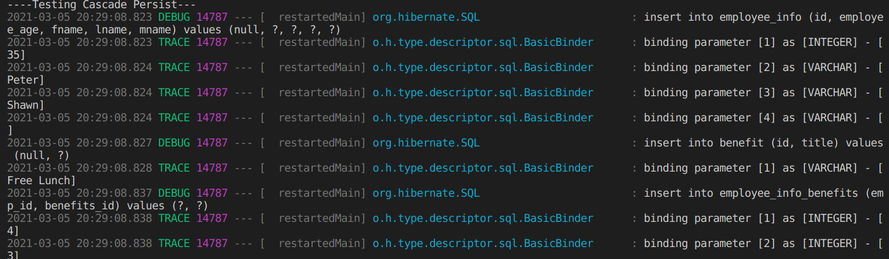
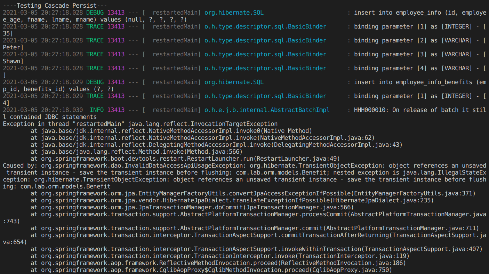
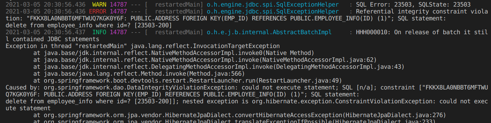
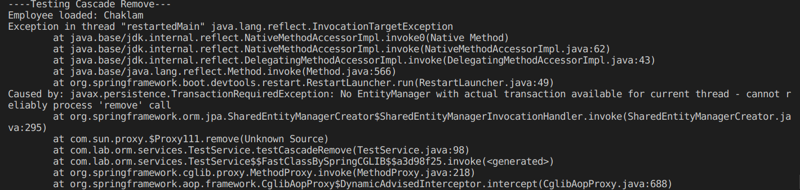
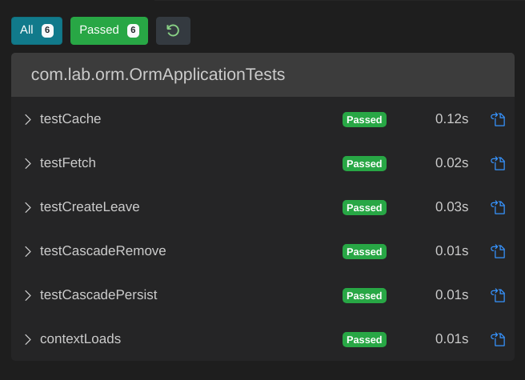

# Lab 3: ORM, Hibernate, JPA and Spring

## Challenges

1. [Set Employee cache to 20 seconds](#cache)
2. [User table has Employee FK](#user-table-has-employee-fk)
3. [Difference between cascade.REMOVE and orphanRemoval=true](#difference-between-cascade.REMOVE-and-orphanRemoval=true)
4. [Remove lazy load from benefits](#remove-lazy-load-from-benefits)
5. [Remove cascades from benefits and addresses](#remove-cascades-from-benefits-and-addresses)
6. [Remove @Transactional](#Remove-@Transactional)
7. [Unit tests](#unit-tests)
8. [Online leave form (TODO)](#Online-leave-form-(TODO))

***

## Cache

For some reason, the cache, even though when setting the timeToLive to 20 seconds, Hibernate still queries the database after only 10 seconds. The employee object should still be in the database. See below. 

### 10 seconds

### 20 seconds (same result)

## User table has Employee FK

## Difference between cascade.REMOVE and orphanRemoval=true

`Cascade.REMOVE` removes the target/child entities whenever the parent entity is removed. In other words, the entities with the foreign key pointing to the parent are deleted. It will not delete when the FK is made null. On the other hand, `orphanRemoval=true` removes the child entities whenever their relationships (i.e. the FKs) are set to null.

## Remove lazy load from benefits

During lazyloading, when the benefits are loaded, an SQL Query is made separately. During eager loading, no separate SQL queries are made. The children are called in the first SQL Query. Please see below.

**Note**: Some error happened - MultipleBagException because Employee has two collections and it is not recommended by Hibernate due to the Cartesian Product being generated. This can be “swept under the carpet” by using Set instead of List but it is not recommended to use Eager loading for multiple collections. [Reference](https://stackoverflow.com/questions/24675340/org-hibernate-loader-multiplebagfetchexception-cannot-simultaneously-fetch-mult).

### Lazy

***

### Eager

***

## Remove cascades from benefits and addresses

The addresses and benefits aren’t persisted in the database after the test is run even though the employee itself is persisted.

However, for Benefits, an error is thrown, reporting that since Benefit is not explicitly persisted, the association table cannot be created.

This fails because the children will be left with empty parents and this violates the FK constraint of SQL.

## Remove @Transactional

Fails because entityManager is a transactional class and all such classes can only have transactional methods. The CRUD methods utilizes these transactions.

## Unit tests

**Note**: `testCache` test case not properly implemented (no assertions).

## Online leave form (TODO)
