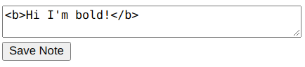

# Lab 4: Microservices + Kubernetes

This lab demonstrates deploying a Spring Boot app to a Kubernetes cluster. The app is first packaged as a JAR file, then containerized as a publicly hosted Docker container and then deployed to a "pod" on Kubernetes. See `kube/note.yaml` for full configuration details. As seen in the config, a service is also run on Kubernetes to route all traffic from port 8080 outside into port 8080 in the pod. For Kubernetes, `minikube` is used since it is best suited for testing.

## JAR Packaging

If using VSCode, simply open the Maven bar in the bottom-left, right-click on the `notetaking` app and select `package`. This will build the app as a JAR file.

## Docker installation

Simply follow the [link](https://docs.docker.com/engine/install/ubuntu/). All commands need `sudo` if guide is followed.

## Kubernetes installation

1. `kubectl`, a CLI for kubernetes, can be installed through [here](https://kubernetes.io/docs/tasks/tools/install-kubectl-linux/#install-using-native-package-management). Check installation with `kubectl version --client`.

2. Simply follow the [guide](https://minikube.sigs.k8s.io/docs/start/).

3. We also need to install Virtualbox. Download [here](https://www.virtualbox.org/wiki/Linux_Downloads) and install. You can run `minikube start --driver=virtualbox` to start a VM and install Kubernetes. Don't worry about the 20000MB Disk as it was okay even though I had much less.

## The app itself

The app is a note taking application that supports formatted text to be saved. The input text itself is formatted using HTML as shown below.

The app running on minkube:

### Technical Details

The parsing of the HTML is done via the `commonmark-java` library. See this [repo](https://github.com/commonmark/commonmark-java).

The complete docker image can be obtained by pulling from [Dockerhub](https://hub.docker.com/r/adamhtoo/note-java):

`docker pull adamhtoo/note-java`
***
